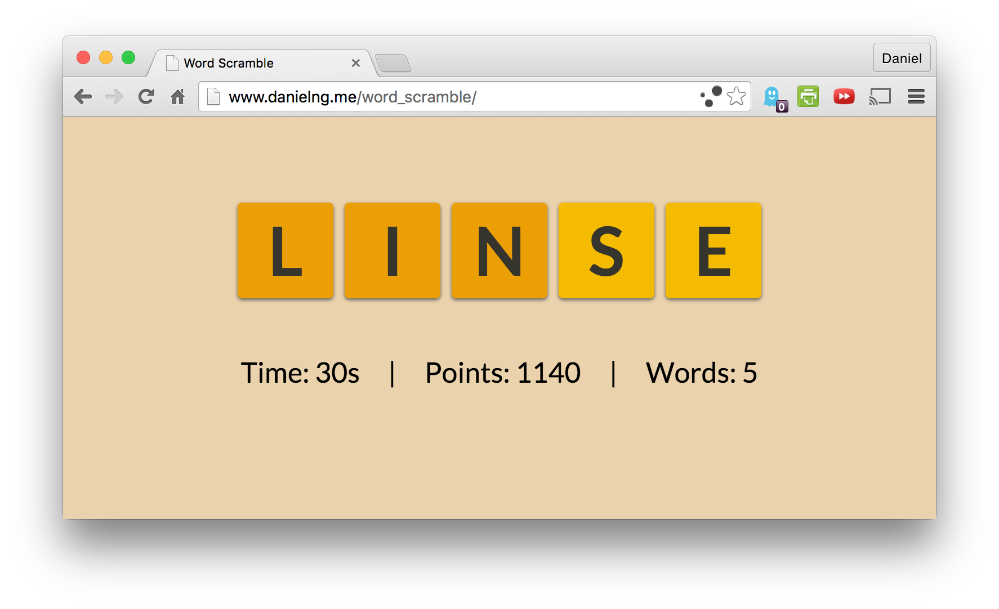

# Word Scramble Game
[Live Link](http://danielng09.github.io/word_scramble/)

## Description
* You try and guess the word that the scrambled letters spell. Try and unscramble as many words as possible until the time runs out.
* Built in React with a Firebase Backend.

##Feature Highlights
* Players can guess valid subwords (words that don't use all the letters) and anagrams for points
* Top 10 scores are saved to a leaderboard using Firebase
* Points calculated by associating values with how common letters are as well as a multiplier for the correct word

##Future Features
* use React motion for transitions (maybe flipping over tiles to switch letters)
